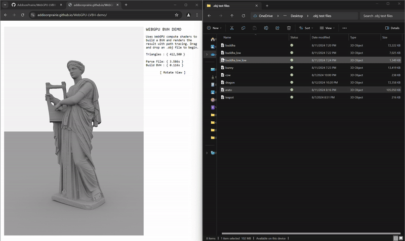

# WEBGPU LBVH demo

This demo builds a linear BVH on the GPU using compute shaders based on the algorithm in [this paper](https://research.nvidia.com/sites/default/files/pubs/2012-06_Maximizing-Parallelism-in/karras2012hpg_paper.pdf). 

You can try the demo [here](https://addisonprairie.github.io/WebGPU-LVBH-demo/) - just drag and drop an .obj model. It uses [this repository](https://github.com/WesUnwin/obj-file-parser) for parsing .obj files.